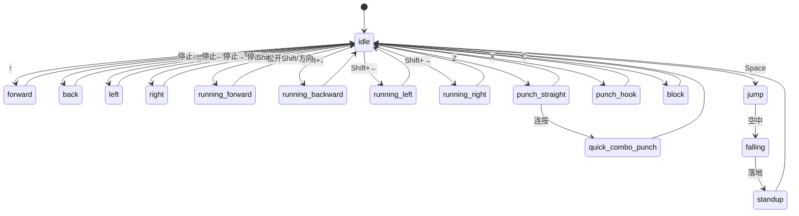

<!-- ab650da7-e2d5-43db-858c-31dbbdb59f2f 76f4a483-8bb6-4c0c-a16a-de7822e9071c -->
# 物理引擎角色控制系统实施计划

该计划旨在为 Player 角色集成物理引擎（Rapier）并实现基于状态机的动画控制系统，使用 mitt 进行事件通信，并支持多视角切换。

## 1. 基础设置与工具 (Setup & Utils)

- **目标**: 引入 mitt 并建立全局事件总线。
- **文件**:
    - `package.json` (安装 `mitt`, `@dimforge/rapier3d-compat`)
    - `src/js/utils/event-bus.js` (新建)
- **任务**:
    - 安装 `mitt`, `@dimforge/rapier3d-compat`。
    - 创建 `event-bus.js` 导出全局唯一的 mitt 实例。

## 2. 输入系统开发 (Input System)

- **目标**: 创建统一的键盘输入管理器。
- **文件**: `src/js/utils/input.js` (新建)
- **功能**:
    - 监听 `keydown`/`keyup` 事件。
    - 维护按键状态映射 (Direction, Shift, Space, Z, X, C, Ctrl)。
    - 使用 `event-bus.js` (mitt) 触发特定动作事件 (Action Events)。

## 3. 物理世界集成 (Physics Integration - Rapier)

- **目标**: 引入 Rapier 物理引擎并替换原有的 Cannon.js。
- **文件**: `src/js/world/physics-world.js`, `src/js/world/player.js`
- **任务**:
    - 初始化 Rapier 物理世界 (World)。
    - 在 `Player` 中创建动态刚体 (RigidBody) 和 胶囊体碰撞器 (Collider - Capsule)。
    - **同步机制**: 在 `update()` 中将 Rapier RigidBody 的位置/旋转同步给 Visual Mesh。
    - 实现运动控制器 (KinematicCharacterController) 或基于力的移动逻辑 (Dynamic)。

## 4. 角色状态机与动画系统 (State Machine & Animation)

- **目标**: 实现基于 PRD 的状态转换和动画混合。
- **文件**: `src/js/world/player.js`
- **全局逻辑说明**:
    - **无输入** → `idle`
    - **单方向键** → `idle` + `方向动画`（forward/back/left/right）混合
    - **Shift + 方向键** → `running_方向`
    - **Ctrl + 方向键** → `方向动画`（不混合 idle）
    - **Z** → 直拳（left/right_straight_punch）
    - **X** → 挂钩拳（left/right_hook_punch）
    - **C** → 格挡（left_block / right_block）
    - **空中自动**：`jump` → `falling` → `standup` → 回到 `idle`
    - **连按（Z/X）**：可触发 `quick_combo_punch`
    - **调试用**：`tpose`
- **控制映射表**:

| 输入方式 | 动画名称 / 行为 | 备注 |

|---|---|---|

| **无输入** | idle | 默认待机 |

| **↑** | idle + forward | Blend 混合 |

| **↓** | idle + back | Blend 混合 |

| **←** | idle + left | Blend 混合 |

| **→** | idle + right | Blend 混合 |

| **Shift + ↑** | running_forward | 跑步 |

| **Shift + ↓** | running_backward | 跑步 |

| **Shift + ←** | running_left | 跑步 |

| **Shift + →** | running_right | 跑步 |

| **Ctrl + 方向键** | forward / back / left / right | “纯方向动画” |

| **Space** | jump | 起跳 |

| **空中（自动）** | falling → standup → idle | 跳跃循环 |

| **Z** | left_straight_punch / right_straight_punch | 直拳 |

| **X** | left_hook_punch / right_hook_punch | 挂钩拳 |

| **C** | left_block / right_block | 格挡 |

| **Z/Z 或 X/X** | quick_combo_punch | 连击 |

| **调试** | tpose | - |

- **状态机图示 (Mermaid)**:

## 5. 相机系统与视角切换 (Camera System)

- **目标**: 支持固定视角与上帝视角的动态切换。
- **文件**: `src/js/camera.js`, `src/js/utils/event-bus.js`
- **任务**:
    - 定义视角模式: `FIXED` (固定), `TOP_DOWN` (上帝视角)。
    - 监听 mitt 事件 `camera:switch-mode`。
    - 实现平滑过渡 (gsap) 或直接切换相机位置/目标。
    - 确保 `TOP_DOWN` 模式下能正确跟随角色 (可选) 或覆盖整个场景。

## 6. UI 开发 (Vue Layer)

- **目标**: 创建视角切换按钮组。
- **文件**: `src/components/CameraControls.vue` (新建), `src/App.vue`
- **功能**:
    - 创建一组按钮: "固定视角", "上帝视角"。
    - 点击时通过 `event-bus.js` 发送 `camera:switch-mode` 事件。

## 7. 调试与优化 (Debug & Polish)

- **任务**:
    - 添加 Debug UI 调整物理参数 (速度、跳跃力) 和 混合权重。
    - 优化动画过渡 (CrossFade)。

### To-dos

- [ ] 创建 InputManager (src/js/utils/input.js) 并集成到 Experience
- [ ] 在 Player 中集成 Cannon.js Body 并实现 Mesh 同步
- [ ] 实现 Player 状态机 (State Machine) 和 动画混合 (Animation Blending)
- [ ] 设置固定相机视角与控制限制
